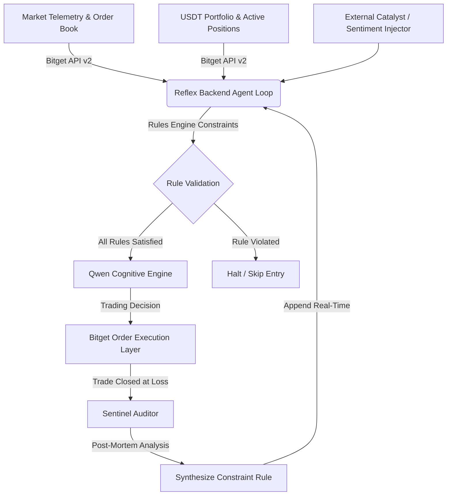

# Reflex: Autonomous Self-Correcting AI Trading Agent

Reflex is an autonomous cognitive trading system built for the **Bitget Hackathon**. It integrates the **Qwen LLM Cognitive Engine** for market decision-making and features a real-time, self-correcting **Sentinel Auditor** loop that writes new rules dynamically on trade losses to prevent repeating past execution mistakes.



---

## 💡 The Core Innovation

Most trading bots execute rigid, pre-defined rules or use static model prompts. When market regimes shift, they continue executing losing strategies. 

Reflex solves this by closing the loop:
1. **Cognitive Analysis**: For every tick (configured at 45 seconds to optimize latency and model throughput), the agent fetches real-time market telemetry, active positions, and recent news sentiment.
2. **Sentinel Audit**: If a trade closes at a loss (due to stop-loss hit or market shift), the Sentinel Auditor runs a cognitive post-mortem analysis to identify the root cause of the failure.
3. **Self-Correction**: The Auditor synthesizes a new natural-language rule (e.g. *“IF news contains 'rate hike' and sentiment is negative, THEN restrict trading to short positions or stay flat”*) and injects it directly into the Rules Engine in real-time. Subsequent ticks evaluate these rules before consulting the model for orders.

---

## 🛠️ Architecture & Tech Stack

- **Backend Node.js Server**: Manages the core 45-second agent tick loop, local state serialization (positions and rules persistence), and WebSocket communication.
- **Frontend React Terminal**: A premium, high-density dashboard built with Vanilla CSS, featuring real-time telemetry charts, execution console logs, active positions, and rule states.
- **Bitget V2 API Integration**: 
  - `GET /api/v2/mix/market/ticker` (Ticker telemetry)
  - `GET /api/v2/mix/account/accounts` (Portfolio balance and equity updates)
  - `GET /api/v2/mix/position/all-position` (Active position monitoring)
  - `POST /api/v2/mix/order/place-order` (Order placement for open/close actions)
- **Qwen API Integration**: Powering the Qwen-3.6-Plus cognitive model for trade decision analysis and sentinel auditing reports.

---

## ⚙️ Installation & Configuration

### 1. Requirements
- Node.js (v18.0.0 or higher)
- npm or yarn

### 2. Environment Variables
Create a `.env` file in the root directory:

```env
PORT=3001
AUTO_START_AGENT=false

# === QWEN COGNITIVE API CONFIGURATION ===
BITGET_QWEN_API_KEY=your_qwen_api_key_here
BITGET_QWEN_URL=https://hackathon.bitgetops.com/v1
BITGET_QWEN_MODEL=qwen3.6-plus

# === BITGET API CONFIGURATION ===
BITGET_API_KEY=your_bitget_api_key_here
BITGET_SECRET_KEY=your_bitget_secret_key_here
BITGET_PASSPHRASE=your_bitget_passphrase_here
BITGET_API_URL=https://api.bitget.com
BITGET_LIVE_MODE=false # Set to 'true' for Mainnet, 'false' for Paper/Testnet Trading (PAPTRADING: 1)
```

*Note: If no API keys are provided in the `.env` file, Reflex automatically boots in a fully local simulated Sandbox Mode (pre-loaded with $10,000.00 mock USDT, simulated positions, and randomized walks) for risk-free evaluation.*

### 3. Running Locally

Install the required dependencies:
```bash
npm install
```

Start the backend server:
```bash
npm run server
```
The server will start on [http://localhost:3001](http://localhost:3001).

In a new terminal window, start the frontend client:
```bash
npm run dev
```
Open [http://localhost:5173](http://localhost:5173) in your browser.

---

## 🕹️ Interactive Walkthrough

1. **Configure Sizing**: Open the **Settings** sidebar, adjust your trade sizes (AUTO size or specific BTC values), and click **Confirm**.
2. **Deploy the Agent**: Hit the **DEPLOY** button in the top navigation bar. The dashboard will connect to the WebSocket and begin broadcasting ticks.
3. **Catalyst Injection**: Enter a news item in the **Sentiment Injector** (e.g. *"US Fed announces aggressive rate hikes due to high inflation"*). Watch the agent ingest the news on the next tick and adjust its trading thesis accordingly.
4. **Sentinel Audit**: If an active position triggers a stop-loss or closes in a loss, the dashboard overlay alerts you that the Sentinel Auditor is compiling its report. The synthesized rule will appear instantly in the **Rules Engine** panel, and the markdown post-mortem report will be added to the **Audit Center** for manual review.
